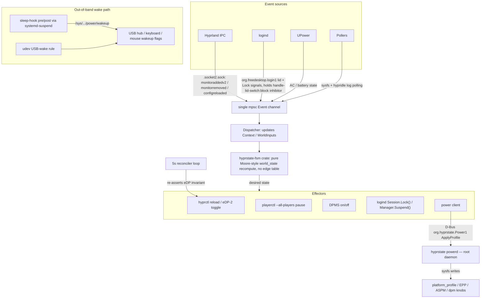
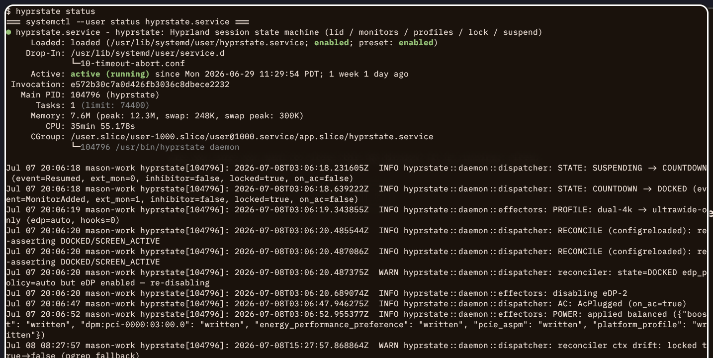

# hyprstate

Single-process session state machine for Hyprland on Framework 16. Owns lid, monitor profiles, eDP-2, lock, suspend, and USB-wake.

## What it owns

- **Lid switch.** Holds a logind `handle-lid-switch:block` inhibitor so logind doesn't suspend on lid close. The FSM decides instead.
- **eDP-2 enable/disable.** Disabled when lid closed, re-enabled (via `hyprctl reload`) when lid opens. Hard invariant — re-asserted by a 5s reconciler and on `configreloaded` events.
- **Monitor profiles.** Auto-applies a profile based on the set of currently-connected monitors. Profiles live as `.conf` snippets in `~/.config/hypr/profiles/` with `#@` directive comments for match signature, hooks, and eDP policy.
- **Suspend grace.** Lid close → 30s window before suspending. Cancellable by lid reopen, monitor hotplug, or new idle inhibitor.
- **Idle-inhibitor awareness.** If an inhibitor is already active at lid close, media is paused (`playerctl --all-players pause`) and the countdown is deferred until the inhibitor releases.
- **Lock-before-suspend.** Calls `Session.Lock()` before `Manager.Suspend()`, waits up to 2s for `LockedHint=true`.
- **DPMS-off when locked + inhibitor.** With an active screen (`LID_OPEN` or `DOCKED`) and the session locked while an inhibitor is held, screens DPMS-off after 30s. Reverses on unlock or inhibitor release.
- **Input-device wake.** A pre/post systemd-sleep hook keeps `/sys/.../power/wakeup` enabled on USB hubs, the ZSA Voyager keyboard, and the Logitech Lightspeed mouse.

## Architecture

All event sources feed one channel; the FSM is a pure function of accumulated world state, and effectors are the only code that touches the system.



## Layout

```
src/, crates/   Rust sources — a single `hyprstate` binary (daemon, powerd, CLI)
dist/           packaged units, dbus policy, udev rule, sleep hook, presets
packaging/      hyprstate.spec (Fedora), PKGBUILD (Arch), build-srpm.sh, migrate-from-devinstall.sh
```

## Subcommands

```
hyprstate daemon                  # run the FSM (systemd --user)
hyprstate powerd                  # root power effector (systemd system, org.hyprstate.Power1)
hyprstate sleep-hook pre|post     # invoked by systemd-suspend (root)
hyprstate status                  # systemctl + journalctl + gpu + power summary
hyprstate power set|get|cycle|status [--waybar]
hyprstate gpu select|check|status # GPU-primary selection (see GPU_SPEC.md)
hyprstate profile list|current|switch|save [NAME]
```

## Install

Packaged install only (Fedora COPR / Arch). The binary is built with `cargo
build --release`; the units, dbus policy, udev rule, sleep hook, and presets
are installed from `dist/` by the spec / PKGBUILD.

**Arch** — add the `[mason]` repo to `/etc/pacman.conf`, then install:

```ini
[mason]
SigLevel = Optional TrustAll
Server = https://masonrhodesdev.github.io/arch-repo/x86_64
```

```sh
sudo pacman -Sy hyprstate
```

**Fedora**

```sh
sudo dnf copr enable solaris765/hyprstate
sudo dnf install hyprstate
```

Then enable the units:

```sh
sudo systemctl enable --now hyprstate-powerd     # root effector
systemctl --user enable --now hyprstate          # session daemon
```

hyprstate's powerd is the **exclusive owner of `platform_profile`** — its unit
`Conflicts=` `power-profiles-daemon`, `tuned`, and `tlp`. Install disables those
on first install (RPM `%post`; Arch `.install` hook) so the boot-time owner is
deterministic. Don't re-enable them alongside hyprstate.

Migrating off the old git-symlink / `install.sh` dev install: run
`packaging/migrate-from-devinstall.sh` once (it removes the `/usr/local`
symlink, the libexec copy, and the `/etc` drop-ins that would shadow the
packaged files), then install the package.

## Releasing

1. Bump the version — `Cargo.toml` (source of truth), `Cargo.lock`, spec
   `Version` (+ `%changelog`), PKGBUILD `pkgver` — in one commit.
2. `git tag vX.Y.Z && git push --tags`

The tag push triggers the release workflow (a thin caller of
[packaging-workflows](https://github.com/MasonRhodesDev/packaging-workflows)),
which does the rest automatically:

- builds the Arch package and attaches it to the tag's GitHub Release,
- pings [arch-repo](https://github.com/MasonRhodesDev/arch-repo) to republish
  the `[mason]` pacman database (otherwise it picks the release up on its
  scheduled run),
- COPR rebuilds the SRPM off its GitHub webhook via `.copr/Makefile`, which
  runs `packaging/build-srpm.sh`.

`packaging/build-srpm.sh` remains fully functional for local use: `--head`
builds an SRPM from HEAD for testing, and `--copr` is still available for a
manual COPR submit if the webhook path is ever unavailable.

## Debug

`hyprstate status` shows unit health plus the recent STATE / PROFILE / POWER transition log:



```
journalctl --user -u hyprstate.service -f       # daemon log
journalctl -u hyprstate-powerd.service -f       # powerd log
sudo tail -f /var/log/hyprstate-sleep.log       # sleep hook log
```

## Dependencies

System: `hyprctl`, `playerctl`, `hyprlock` (via hypridle's `lock_cmd`), `hypridle` (catches the logind Lock signal and runs hyprlock). Build: `cargo` / `rustc`.
